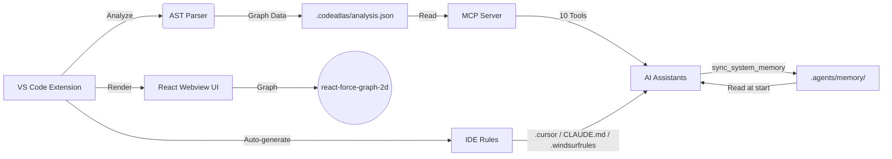

# 🗺️ CodeAtlas

**AI-powered code analysis & memory for VS Code, Cursor, Windsurf**

[](https://github.com/giauphan/CodeAtlas/releases)
[](https://marketplace.visualstudio.com/)
[](https://www.npmjs.com/package/@giauphan/codeatlas-mcp)
[](https://github.com/giauphan/CodeAtlas/actions)
[](LICENSE)

> **Analyze your codebase once → AI understands it forever.**
>
> CodeAtlas gives AI assistants (Gemini, Claude, Cursor, Windsurf, Copilot) deep understanding of your code via MCP — with persistent memory between conversations.

---

## ✨ Why CodeAtlas?

| Problem | CodeAtlas Solution |
|---|---|
| AI forgets your project structure every conversation | **Persistent memory** in `.agents/memory/` |
| AI greps files blindly, missing relationships | **10 MCP tools** for instant code intelligence |
| No way to see how features flow through code | **Mermaid diagrams** of execution flows |
| Hard to onboard on new codebases | **Auto-generated architecture maps** |
| Different AI IDEs need different configs | **Auto-generates rules** for Cursor, Claude, Windsurf, Gemini |

---

## 🚀 Quick Start (2 minutes)

### Step 1: Install the Extension

Download `codeatlas-1.6.0.vsix` from [Releases](https://github.com/giauphan/CodeAtlas/releases), then:

```
VS Code: Extensions → ⋯ → Install from VSIX
```

### Step 2: Analyze Your Project

```
Ctrl+Shift+P → CodeAtlas: Analyze Project
```

This generates:
- `.codeatlas/analysis.json` — Code structure data
- `.agents/memory/` — AI-readable system documentation
- `.agents/rules/` — MCP instructions for AI
- IDE-specific rules for **Cursor** / **Claude** / **Windsurf** (auto-detected)

### Step 3: Connect Your AI

Pick your AI IDE and add the MCP config:

<details>
<summary>🟢 <b>Gemini / Antigravity</b> — <code>.gemini/settings.json</code></summary>

```json
{
  "mcpServers": {
    "codeatlas": {
      "command": "npx",
      "args": ["-y", "@giauphan/codeatlas-mcp"]
    }
  }
}
```
</details>

<details>
<summary>⚫ <b>Cursor</b> — <code>.cursor/mcp.json</code></summary>

```json
{
  "mcpServers": {
    "codeatlas": {
      "command": "npx",
      "args": ["-y", "@giauphan/codeatlas-mcp"]
    }
  }
}
```
</details>

<details>
<summary>🔵 <b>VS Code Copilot</b> — <code>.vscode/settings.json</code></summary>

```json
{
  "mcp": {
    "servers": {
      "codeatlas": {
        "command": "npx",
        "args": ["-y", "@giauphan/codeatlas-mcp"]
      }
    }
  }
}
```
</details>

<details>
<summary>🟣 <b>Claude Desktop</b> — <code>claude_desktop_config.json</code></summary>

```json
{
  "mcpServers": {
    "codeatlas": {
      "command": "npx",
      "args": ["-y", "@giauphan/codeatlas-mcp"]
    }
  }
}
```
</details>

<details>
<summary>🟣 <b>Claude Code CLI</b></summary>

```bash
claude mcp add codeatlas -- npx -y @giauphan/codeatlas-mcp
```
</details>

<details>
<summary>🔴 <b>Windsurf</b> — <code>.windsurf/mcp.json</code></summary>

```json
{
  "mcpServers": {
    "codeatlas": {
      "command": "npx",
      "args": ["-y", "@giauphan/codeatlas-mcp"]
    }
  }
}
```
</details>

> **That's it!** Your AI now understands your codebase structure, dependencies, and can remember context across conversations.

---

## 🛠️ MCP Tools (10 tools)

### Code Analysis

| Tool | What it does |
|------|-------------|
| `list_projects` | List all analyzed projects (auto-discovers `~/`) |
| `get_project_structure` | Get all modules, classes, functions, variables |
| `get_dependencies` | Get import / call / containment / implements relationships |
| `get_insights` | AI-generated code quality & security insights |
| `search_entities` | Fuzzy search by entity name (faster than grep!) |
| `get_file_entities` | Get all entities defined in a specific file |

### Architecture Visualization

| Tool | What it does |
|------|-------------|
| `generate_system_flow` | Auto-generate Mermaid **architecture diagrams** (module imports) |
| `generate_feature_flow_diagram` | Auto-generate Mermaid **execution flow diagrams** (call chains) |

### AI Memory

| Tool | What it does |
|------|-------------|
| `sync_system_memory` | Create/update `.agents/memory/` — AI's persistent long-term memory |
| `trace_feature_flow` | Trace a feature through the codebase, returns files in dependency order |

---

## 🧠 AI Memory System

AI assistants lose context between conversations. CodeAtlas solves this:

```
Conversation 1 → AI writes code → calls sync_system_memory
                                          │
                                   .agents/memory/
                                   ├── system-map.md      ← Mermaid architecture
                                   ├── modules.json       ← All modules & entities
                                   ├── conventions.md     ← Code patterns & style
                                   ├── business-rules.json ← Domain logic
                                   ├── feature-flows.json  ← Feature traces
                                   └── change-log.json     ← What changed & when
                                          │
Conversation 2 → AI reads .agents/memory/ → knows full system flow instantly
```

### Auto-Generated IDE Rules

On `Analyze Project`, CodeAtlas automatically creates rule files so your AI **knows how to use CodeAtlas** out of the box:

| File Generated | For |
|---|---|
| `.agents/rules/codeatlas-mcp.md` | Generic (all AIs) |
| `.agents/rules/auto-memory.md` | Memory read/sync instructions |
| `.cursor/rules/codeatlas.mdc` | Cursor |
| `CLAUDE.md` | Claude Code |
| `.windsurfrules` | Windsurf |

> Files are only created if they don't exist — **your customizations are never overwritten**.

---

## 🌐 VS Code Extension Features

- **Interactive Force-Directed Graph** — Visualize code architecture and dependencies
- **AST-Based Analysis** — Deep semantic understanding, not just text matching
- **AI Copilot Chat** — Ask architectural questions about your codebase
- **Entity Overview** — Clear counts of modules, classes, functions, relationships
- **Click-to-Navigate** — Jump from graph nodes to source code
- **Auto-Reanalyze on Save** — Graph updates as you code
- **Search & Filter** — Find specific entities, filter by type

---

## 🌍 Supported Languages

| Language | Parser | Features |
|----------|--------|----------|
| TypeScript / JavaScript | `@typescript-eslint/typescript-estree` | Full AST: imports, classes, functions, variables, calls, implements |
| Python | Regex-based | Classes, functions, variables, imports, calls |
| PHP | Regex-based | Classes, interfaces, traits, enums, functions, properties, constants |
| Blade Templates | Regex-based | `@extends`, `@include`, `@component`, `<x-component>` |

---

## 🏗️ Architecture



---

## 🧑‍💻 Contributing

We welcome contributions! To get started:

```bash
git clone https://github.com/giauphan/CodeAtlas.git
cd CodeAtlas
npm install
npm run build
# Press F5 in VS Code to launch Extension Development Host
npm test  # Run tests
```

---

## 📦 Tech Stack

| Component | Technology |
|---|---|
| Extension Host | VS Code API, TypeScript |
| AST Parser | `@typescript-eslint/typescript-estree`, Python & PHP regex |
| MCP Server | `@modelcontextprotocol/sdk`, Zod |
| Webview UI | React, Vite |
| Graph | `react-force-graph-2d` |
| CI | GitHub Actions |
| Build | `esbuild`, `tsc`, `vsce` |

## License

[MIT](LICENSE) — Free for personal and commercial use.
