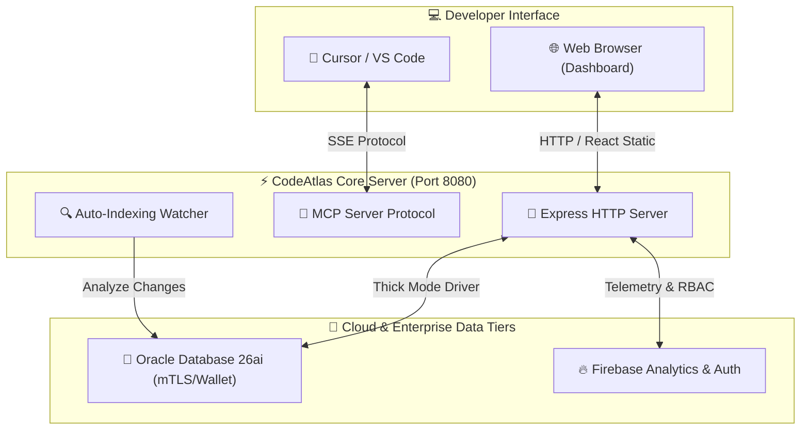

# 🗺️ CodeAtlas Enterprise — Quickstart & Setup Guide

Welcome to **CodeAtlas Enterprise (Oracle 26ai Edition)**! This comprehensive guide will walk you through the system architecture, quick local setup, production hosting, and configuring your AI editor (Cursor, VS Code, Claude) to use the codebase intelligence engine.

---

## 🏗️ 1. Architecture Overview

CodeAtlas operates as a unified, high-performance ecosystem bridging your local code workspace, modern interactive visualization, and persistent database-backed intelligence.



---

## ⚡ 2. One-Command Quickstart (Dev Mode)

If you have Node.js and the Oracle client already configured, simply run:

```bash
# Start both backend server and frontend compiler concurrently
npm run build && npx pm2 restart 0
```

---

## 🛠️ 3. Step-by-Step Installation

### Step 3.1: Prerequisites
* **Node.js**: `v20.0.0` or higher
* **Oracle Instant Client**: Required for Thick Mode database connection (pre-packaged in `./instantclient`)

---

### Step 3.2: Backend Server Configuration
1. Clone the repository and install dependencies:
   ```bash
   git clone https://github.com/giauphan/CodeAtlas.git
   cd CodeAtlas
   npm install
   ```

2. Configure your environment variables in `.env`:
   ```env
   PORT=8080
   CODEATLAS_API_KEY="your_api_key_here"
   
   # Oracle 26ai Cloud Database Credentials
   ORACLE_USER="ADMIN"
   ORACLE_PASSWORD="your_database_password"
   ORACLE_CONN_STRING="(description=(address=(protocol=tcps)(port=1522)(host=adb.ap-singapore-1.oraclecloud.com))...)"
   ORACLE_LIB_DIR="./instantclient"
   ORACLE_WALLET_DIR="./wallet"
   ORACLE_WALLET_PASSWORD="your_wallet_password"
   ```

3. Build and initialize the server database schemas:
   ```bash
   npm run build
   npm run db-init
   ```

---

### Step 3.3: Interactive React Dashboard Build
Build the stunning neural frontend dashboard. This creates optimized production assets inside `dashboard/dist`, which the backend automatically serves static-ready:

```bash
cd dashboard
npm install
npm run build
cd ..
```

---

### Step 3.4: Run in Production with PM2 (Recommended)
Keep the server running resiliently in the background using PM2:

```bash
# Start/Restart the process under PM2
npx pm2 start dist/index.js --name "codeatlas-enterprise" --env PORT=8080

# Monitor logs in real time
npx pm2 logs
```

The enterprise server is now running on **`http://localhost:8080`**!

---

## 📊 4. Knowledge Graph Interactive Guide

The interactive **Knowledge Network** provides dynamic physics-based visualization of your codebase:

```
                  [ Knowledge Network HUD ]
┌────────────────────────────────────────────────────────┐
│  🖱️ Mouse Drag  ---------> Pan across the canvas        │
│  🔍 Scroll Wheel -------> Smooth zoom (0.2x to 6.0x)   │
│  ⚡ Node Drag    ---------> Inspect specific imports     │
│  📺 Maximize     ---------> Enter Fullscreen Canvas     │
└────────────────────────────────────────────────────────┘
```

### Fullscreen Mode 📺
* **Enter Fullscreen**: Click the glassmorphic `Maximize` button inside the HUD panel at the bottom-right of the graph.
* **Layout Transition**: The parent borders are dynamically streamlined to `0px` and the background transitions to a solid `#0A0C10` color.
* **Exit**: Click the `Minimize` button or press the **`Escape`** key on your keyboard.

---

## 🤖 5. Configure Your AI Editor (MCP Client)

Connect your AI coding assistants to CodeAtlas to allow them to explore the codebase, generate system flows, and track business rules.

### 5.1: Cursor Configuration
1. Open Cursor Settings -> **Models** -> **MCP**.
2. Click **+ Add New MCP Tool**.
3. Fill in the parameters:
   * **Name**: `codeatlas`
   * **Type**: `sse`
   * **URL**: `http://localhost:8080/sse`

---

### 5.2: VS Code Configuration (Gemini / Antigravity)
Add this server block to your `.gemini/settings.json`:

```json
{
  "mcpServers": {
    "codeatlas": {
      "command": "npx",
      "args": ["-y", "@giauphan/codeatlas-mcp"]
    }
  }
}
```

---

### 5.3: Claude Desktop Configuration
Add this to your `claude_desktop_config.json`:

```json
{
  "mcpServers": {
    "codeatlas": {
      "command": "node",
      "args": ["/home/biibon/CodeAtlas/dist/index.js"]
    }
  }
}
```

---

## ⚡ 6. CLI & Development Command Reference

| Action | Command | Scope |
| :--- | :--- | :--- |
| **Setup DB** | `npm run db-init` | Initialize Oracle schemas & tables |
| **Compile Server** | `npm run build` | Compile TypeScript backend server |
| **Compile Frontend** | `npm run build` *(in /dashboard)* | Build static production assets |
| **Start Dev Server** | `npm run dev` | Launch server with active `tsx` watcher |
| **Run Unit Tests** | `npm run test` | Run full test suite (24/24 passing) |
| **Restart Backend** | `npx pm2 restart 0` | Reload active running server |
