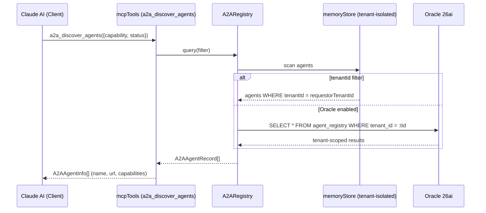
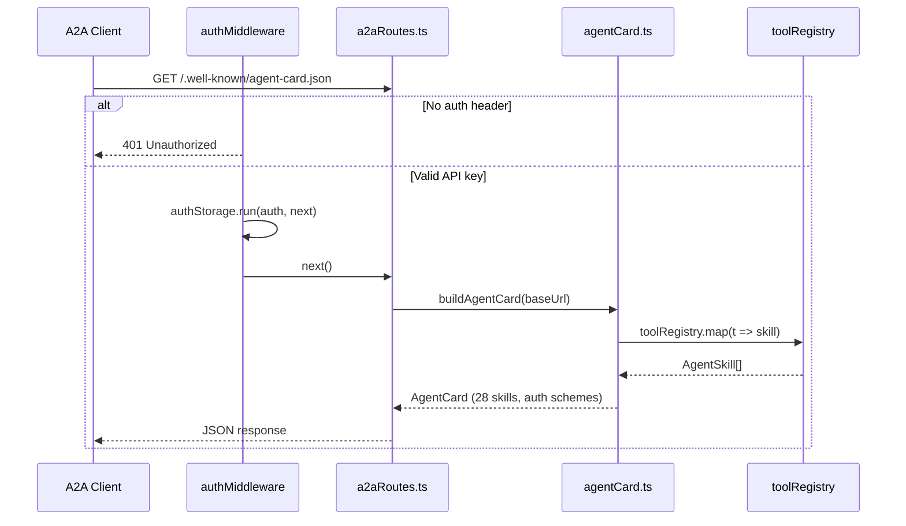
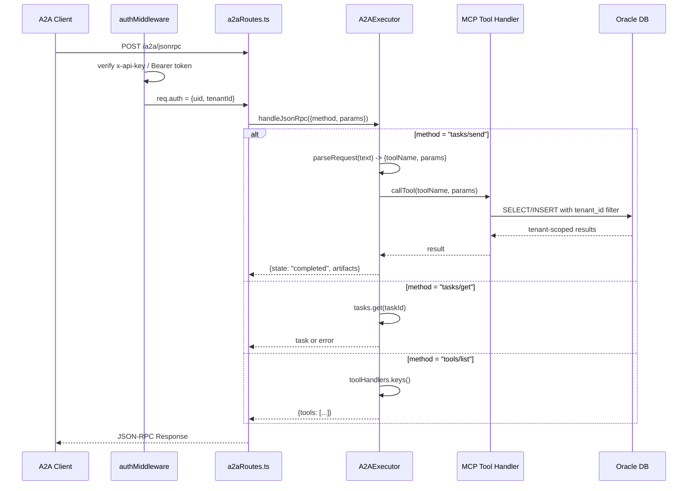
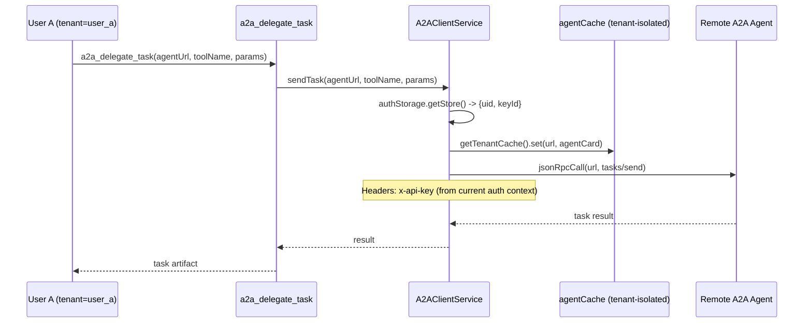
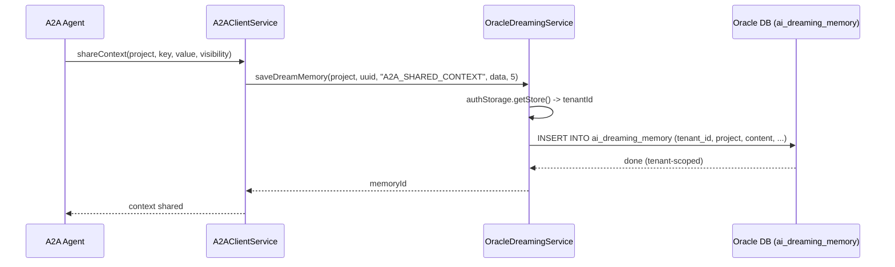
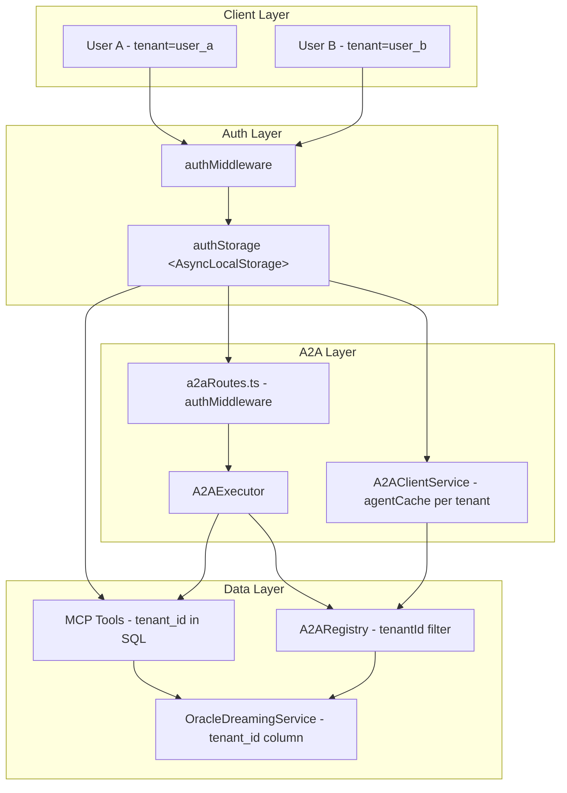
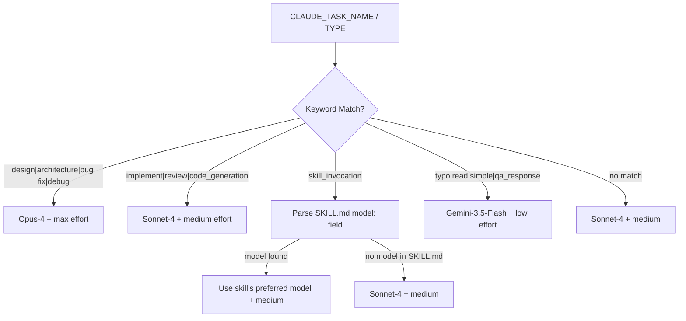
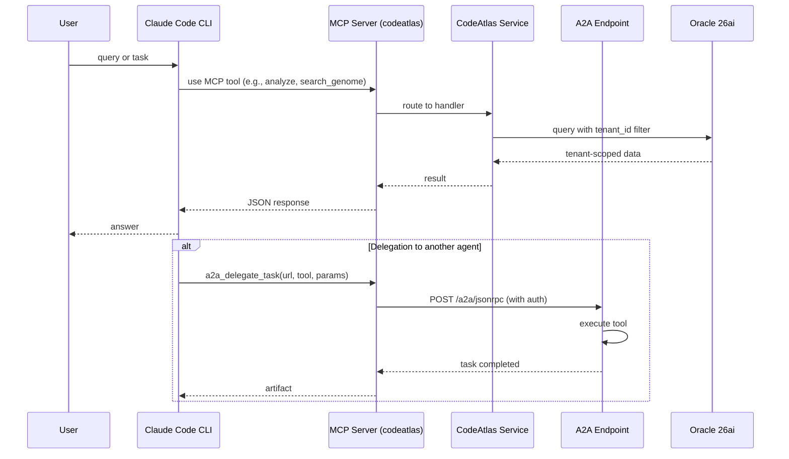
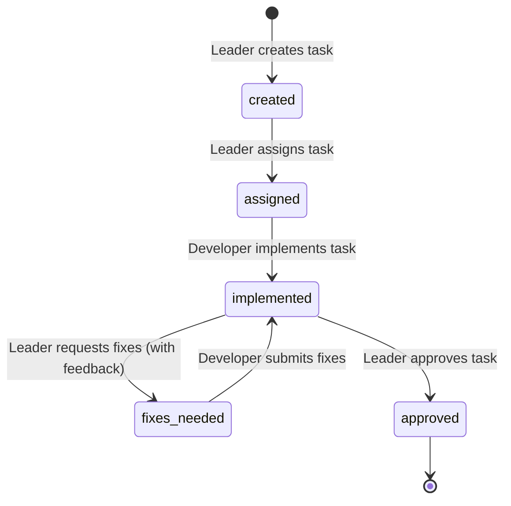
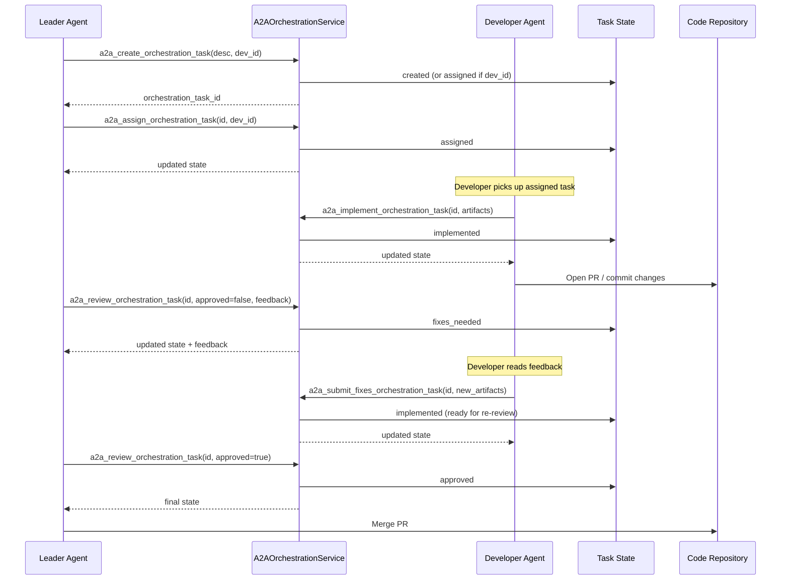

# A2A Flow Diagram

## 1. Agent Discovery Flow



## 2. Agent Card (/.well-known/agent-card.json)



## 3. A2A JSON-RPC (a2a/jsonrpc)



## 4. Task Delegation (Internal A2A Call)



## 5. Context Sharing (a2a_broadcast_context)



## 6. Multi-Tenant Architecture



## 7. Model Routing (task-router.sh)



## 8. End-to-End Flow (Claude → CodeAtlas → A2A → Backend)



---

## 9. A2A Orchestration Flow (Leader-Developer Workflow)

### Task State Machine



### Orchestration Sequence Flow



### Orchestration Tools Summary

| Tool | Role | Description |
|------|------|-------------|
| `a2a_create_orchestration_task` | Leader | Create task (`created` or `assigned`) |
| `a2a_assign_orchestration_task` | Leader | Assign task to developer (`assigned`) |
| `a2a_implement_orchestration_task` | Developer | Report implementation (`implemented`) |
| `a2a_review_orchestration_task` | Leader | Review or approve (`implemented` → `approved` or `fixes_needed`) |
| `a2a_submit_fixes_orchestration_task` | Developer | Submit fixes (`fixes_needed` → `implemented`) |
| `a2a_get_orchestration_task` | Generic | Get task status and details |

### Orchestration Data Model

```typescript
A2AOrchestrationTask {
  orchestrationTaskId: string
  tenantId: string          // tenant isolation
  leaderAgentId: string
  developerAgentId?: string
  state: OrchestrationState // created | assigned | implemented | fixes_needed | approved
  description: string
  toolName?: string         // MCP tool for developer
  toolParams?: Record<string, unknown>
  artifacts?: Artifact[]    // implementation outputs
  feedback?: string         // leader review feedback
  prUrl?: string
  reviewBotFindings?: string
  stateHistory: { state, timestamp, note }[]  // audit trail
}
```
